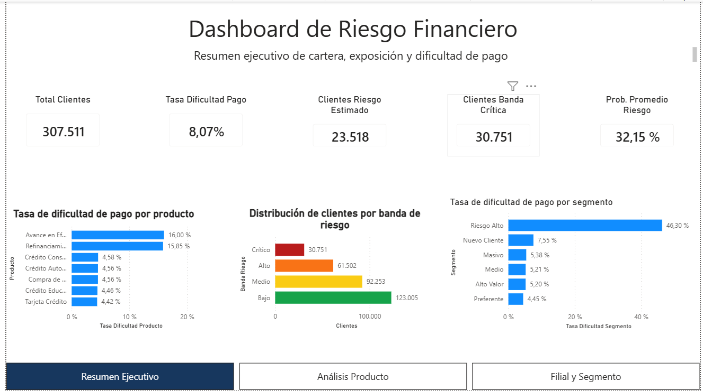

# Analítica Financiera de Riesgo y Rentabilidad

Proyecto orientado a la construcción de una solución analítica integral para monitoreo financiero, riesgo crediticio, rentabilidad, scoring predictivo y toma de decisiones ejecutivas.

El proyecto simula el caso de una organización financiera con múltiples productos, canales, segmentos y perfiles de clientes. La solución integra procesamiento de datos, modelamiento analítico, dashboard ejecutivo en Power BI, Machine Learning, interpretabilidad del modelo y scoring operativo.

---

## 1. Resumen del proyecto

El objetivo del proyecto es construir una solución reproducible que permita:

- consolidar y transformar datos financieros y crediticios;
- construir una arquitectura analítica por capas;
- monitorear exposición, rentabilidad y dificultad de pago;
- desarrollar un modelo predictivo de riesgo;
- interpretar el comportamiento global del modelo;
- generar scoring operativo para priorización de clientes;
- integrar resultados predictivos en un dashboard ejecutivo de Power BI.

El proyecto combina técnicas de **Business Intelligence**, **Data Engineering**, **Machine Learning** e **interpretabilidad de modelos** aplicadas a un problema financiero realista.

## Vista del dashboard

A continuación se muestra una vista del resumen ejecutivo del dashboard desarrollado en Power BI:




---

## 2. Problema de negocio

Una institución financiera necesita monitorear el desempeño de su cartera, identificar deterioro crediticio, priorizar clientes de mayor riesgo y apoyar decisiones estratégicas sobre productos, segmentos y canales.

El problema no se limita a reportar indicadores históricos. La solución busca pasar desde un enfoque descriptivo hacia una herramienta analítica que combine:

- riesgo observado;
- exposición financiera;
- rentabilidad esperada;
- segmentación de clientes;
- predicción de dificultad de pago;
- priorización operativa por bandas de riesgo.

---

## 3. Objetivos

### Objetivo general

Construir una solución analítica end-to-end para riesgo y rentabilidad financiera, integrando datos, métricas ejecutivas, modelos predictivos y visualización en Power BI.

### Objetivos específicos

- Diseñar una arquitectura local de datos usando DuckDB.
- Crear capas analíticas tipo `raw`, `std`, `cst` y `mart`.
- Desarrollar validaciones de calidad de datos.
- Construir un dashboard ejecutivo de riesgo financiero en Power BI.
- Entrenar y comparar modelos de Machine Learning para predicción de dificultad de pago.
- Optimizar un modelo XGBoost con Optuna.
- Interpretar el modelo mediante SHAP.
- Generar scoring operativo para toda la cartera.
- Integrar resultados predictivos al dashboard ejecutivo.
- Documentar el proyecto para GitHub y portafolio profesional.

---

## 4. Stack tecnológico

- **Python**: procesamiento, modelamiento, scoring y automatización.
- **SQL**: transformación y modelado analítico.
- **DuckDB**: base analítica local.
- **Power BI**: dashboard ejecutivo.
- **Quarto**: documentación reproducible.
- **scikit-learn**: pipelines, partición de datos y métricas.
- **XGBoost**: modelo predictivo principal.
- **Optuna**: optimización de hiperparámetros.
- **SHAP**: interpretabilidad global del modelo.
- **Git / GitHub**: control de versiones.

---

## 5. Arquitectura analítica

El proyecto utiliza una arquitectura por capas dentro de DuckDB:

```text
raw_data
  ↓
std_data
  ↓
cst_data
  ↓
mart_financiero
```

### Capas principales

- **raw_data**: datos originales o vistas sobre archivos fuente.
- **std_data**: estandarización de nombres, formatos y tipos.
- **cst_data**: datos curados, enriquecidos y preparados para análisis/modelamiento.
- **mart_financiero**: tablas analíticas finales para dashboard, scoring y reporting.

---

## 6. Componentes principales

### 6.1 Diagnóstico y calidad de datos

El proyecto incluye revisión de estructura, tipos de datos, valores nulos, consistencia de columnas y validaciones básicas para preparar una base confiable de análisis.

Documentos principales:

```text
docs/01_diagnostico_datos.qmd
docs/02_calidad_datos.qmd
```

---

### 6.2 Mart financiero

Se construyen tablas analíticas orientadas a consumo ejecutivo en Power BI, incluyendo métricas por producto, segmento, filial y canal.

Documentos principales:

```text
docs/03_mart_financiero.qmd
docs/04_mart_financiero_consumo.qmd
docs/05_documentacion_powerbi.qmd
```

---

### 6.3 Dashboard Power BI

El dashboard permite monitorear:

- total de clientes;
- tasa de dificultad de pago;
- exposición crediticia;
- monto en riesgo;
- riesgo por producto;
- riesgo por segmento;
- scoring predictivo integrado al resumen ejecutivo.

Archivo principal:

```text
powerbi/dashboard_riesgo_financiero.pbix
```

---

## 7. Modelo predictivo de riesgo

Se desarrolló un modelo de Machine Learning para predecir la probabilidad de dificultad de pago de clientes.

### Dataset de modelamiento

- Registros: 307.511 clientes.
- Variable objetivo: `flag_dificultad_pago`.
- Tasa del evento: aproximadamente 8,07%.
- Variables predictoras finales: 59.
- Variables numéricas: 19.
- Variables categóricas: 40.

### Partición de datos

```text
70% entrenamiento
20% prueba
10% validación final
```

### Modelos evaluados

- Regresión logística.
- Random Forest.
- XGBoost.
- XGBoost optimizado con Optuna.

### Modelo final

El modelo definitivo fue un **XGBoost optimizado con Optuna**.

Métricas principales en validación final:

```text
Accuracy:           0,9161
Balanced Accuracy: 0,7217
Precision:          0,4810
Recall:             0,4897
F1-score:           0,4853
ROC-AUC:            0,8575
PR-AUC:             0,4889
```

Documento principal:

```text
docs/06_modelo_riesgo_ml.qmd
```

---

## 8. Interpretabilidad del modelo

Se utilizó SHAP para interpretar globalmente el comportamiento del modelo.

El análisis mostró que las variables más influyentes están relacionadas con:

- scores externos;
- segmento del cliente;
- producto financiero;
- margen esperado del producto;
- antigüedad laboral;
- condiciones financieras del crédito.

Hallazgos principales:

- `score_promedio_externo` reduce el riesgo estimado cuando toma valores altos.
- `id_segmento_SEG_005` aumenta fuertemente el riesgo estimado.
- `margen_esperado_producto` muestra asociación entre productos de mayor margen y mayor riesgo estimado.
- El modelo combina señales crediticias, comerciales y financieras, en vez de depender de una sola variable.

Documento principal:

```text
docs/07_interpretabilidad_modelo.qmd
```

Tablas exportadas:

```text
reports/tables/importancia_shap_variables_originales.csv
reports/tables/importancia_shap_variables_transformadas.csv
```

---

## 9. Scoring operativo

El modelo final fue aplicado sobre toda la cartera de clientes para generar scoring operativo.

La salida incluye:

- probabilidad estimada de dificultad de pago;
- clasificación binaria según umbral;
- banda de riesgo por percentiles;
- variables analíticas relevantes;
- exportación para Power BI.

### Bandas de riesgo

Se utilizó una priorización equilibrada por percentiles:

```text
Top 10%      → Crítico
10% - 30%    → Alto
30% - 60%    → Medio
60% - 100%   → Bajo
```

Resultados principales:

```text
Clientes scoreados:               307.511
Clientes con riesgo estimado:       23.518
Clientes en banda crítica:          30.751
Probabilidad promedio de riesgo:    32,15%
```

Resumen por banda:

```text
Crítico: 30.751 clientes
Alto:    61.502 clientes
Medio:   92.253 clientes
Bajo:   123.005 clientes
```

Documento principal:

```text
docs/08_scoring_operativo.qmd
```

Tablas exportadas:

```text
reports/tables/scoring_riesgo_clientes.csv
reports/tables/resumen_scoring.csv
reports/tables/resumen_banda_riesgo.csv
```

---

## 10. Resultados principales

El proyecto permitió construir una solución analítica completa que integra datos, reporting, Machine Learning e interpretabilidad.

Resultados destacados:

- Dashboard ejecutivo en Power BI con métricas observadas y predictivas.
- Modelo XGBoost con ROC-AUC cercano a 0,86.
- Interpretabilidad global mediante SHAP.
- Scoring operativo para más de 300 mil clientes.
- Priorización de cartera por bandas de riesgo.
- Arquitectura reproducible con Python, SQL, DuckDB y Quarto.
- Uso de Git como control de versiones durante todo el desarrollo.

---

## 11. Estructura del repositorio

```text
analitica-financiera-riesgo/
│
├── data/
│   └── database/
│
├── docs/
│   ├── 00_fase_0_alcance_proyecto.qmd
│   ├── 01_diagnostico_datos.qmd
│   ├── 02_calidad_datos.qmd
│   ├── 03_mart_financiero.qmd
│   ├── 04_mart_financiero_consumo.qmd
│   ├── 05_documentacion_powerbi.qmd
│   ├── 06_modelo_riesgo_ml.qmd
│   ├── 07_interpretabilidad_modelo.qmd
│   └── 08_scoring_operativo.qmd
│
├── models/
│   ├── modelo_riesgo_xgboost.joblib
│   ├── configuracion_modelo_riesgo.json
│   └── metricas_validacion_final.csv
│
├── powerbi/
│   └── dashboard_riesgo_financiero.pbix
│
├── reports/
│   ├── docs/
│   └── tables/
│
├── sql/
│   ├── 00_admin/
│   ├── 01_raw/
│   ├── 02_std/
│   ├── 03_cst/
│   └── 04_mart_financiero/
│
├── src/
│
├── README.md
├── requirements.txt
└── .gitignore
```

---

## 12. Reproducción del proyecto

La reproducción completa del proyecto se documenta en:

```text
docs/REPRODUCCION_PROYECTO.md
```

Flujo general:

```text
1. Crear entorno virtual.
2. Instalar dependencias.
3. Crear schemas en DuckDB.
4. Cargar o conectar datos fuente.
5. Ejecutar transformaciones SQL/Python.
6. Generar mart financiero.
7. Renderizar documentos Quarto.
8. Entrenar modelo predictivo.
9. Calcular interpretabilidad SHAP.
10. Generar scoring operativo.
11. Abrir dashboard Power BI.
```

---

## 13. Limitaciones

Este proyecto fue desarrollado como caso de portafolio y simulación analítica. Algunas limitaciones relevantes son:

- Los datos fueron adaptados y enriquecidos para construir un caso financiero realista.
- El modelo no representa una solución productiva lista para uso regulatorio.
- Las relaciones encontradas por SHAP deben interpretarse como asociaciones, no causalidad.
- No se implementó monitoreo temporal de drift.
- No se implementó despliegue automático del modelo.
- El dashboard consume tablas resumen y archivos exportados, no una conexión productiva en tiempo real.

---

## 14. Próximos pasos

Posibles extensiones del proyecto:

- Monitoreo temporal de performance del modelo.
- Análisis de drift de variables predictoras.
- Simulación de estrategias de cobranza preventiva.
- Incorporación de costos de falsos positivos y falsos negativos.
- Evaluación de rentabilidad ajustada por riesgo.
- Automatización completa del pipeline.
- Publicación del dashboard en Power BI Service.

---

## 15. Autor

Proyecto desarrollado por **Sebastián Carrillo S.**